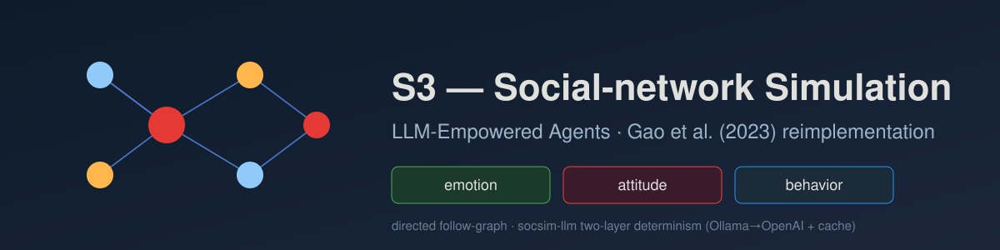

<p align="center"></p>

[English](README.md) | **日本語**

# S3: Social-network Simulation System with Large Language Model-Empowered Agents — Gao et al. (2023)

Gao et al. (2023)「S3: Social-network Simulation System with Large Language Model-Empowered Agents」(arXiv:2307.14984) の再現実装．LLM 駆動エージェントの集団が **有向** ソーシャルネットワーク (フォロー関係) 上に配置され，各ラウンドでエージェントはフォロー相手からの重要メッセージを知覚し，LLM が **感情** (calm / moderate / intense)・**態度** (negative / positive)・**相互作用行動** (repost / post / inactive) を同時に更新する．投稿/転送を行うとその内容は次ラウンドにフォロワへ届き，個人レベルの更新から情報・態度・感情の **集団レベル伝播** が創発する．決定論的な [socsim](https://github.com/akitenkrad/rs-social-simulation-tools) コアが有向網・メッセージ配送・活性化順序・指標を担い，非決定的な LLM レイヤは 1 つのメカニズムに閉じ込めて `socsim-llm` クレット (プロンプト→応答キャッシュ + `temperature=0` + seed 固定) で擬似決定論化する．

## 二層決定論 (最初に読むこと)

LLM 出力は socsim の bit 再現性の **外側** にある．そのため設計は二層に分かれる:

- **決定論的 socsim コア** — 有向網生成・フォロー辺に沿ったメッセージ配送・`RandomActivationScheduler` の活性化順序 (`ctx.rng`, ChaCha20)・指標・収束判定．seed を与えれば bit 単位で再現する．
- **非決定的 LLM レイヤ** — 感情/態度/行動の同時決定と投稿コンテンツ生成．`socsim-llm` の `CachingClient` (`hash(prompt+model)` → 応答キャッシュ)・`temperature=0`・seed 固定で擬似決定論化する．プロバイダ順序は `FallbackClient` による **Ollama 第一 → OpenAI フォールバック**．

再現性の本体はモデルではなく **キャッシュ** である．ウォームキャッシュは同一応答を再生するため，再実行はコスト 0 かつ安定する．各実行はモデル・provider・温度を runvault の `run.json` の `llm` ブロックに，呼び出し数と cache-hit 率を `metrics.csv` の run スコープ指標に記録する．ローカル既定モデル (`llama3.2:latest`) は論文の GPT 系と異なるため，再現目標は **定性的** (伝播曲線 — 態度割合・感情分布・行動採用・カスケード成長 — の傾向と符号) とし，論文の正確な MSED / Cor 値の一致は狙わない．

## 有向フォローグラフ

論文はフォロー関係に基づく有向グラフを用いる．これは socsim-net で対応済み (`DiSocialNetwork`, issue #18) で，**issue #28** で有向生成器も追加された．規約: 有向辺 **`A → B` = 「A が B をフォロー」**．したがって B の投稿は B の **フォロワ** = B の in-neighbours (`in_neighbors(B)`) に届く．BA / ER は有向生成器 (`barabasi_albert_directed` / `erdos_renyi_directed`) で直接構築する．WS には有向生成器が無いため，無向 `watts_strogatz` を生成してから `to_directed(p_mutual)` (既定 `0.5`，`--ws-p-mutual` で指定) で方向を付与する．詳細は [docs/architecture.ja.md](docs/architecture.ja.md)．

## インストールとクイックスタート

```bash
# Rust シミュレーションをビルド (socsim と socsim-llm の Ollama+OpenAI バックエンドを取得)
cargo build --release

# ローカル Ollama を起動しモデルを pull する (例):
#   ollama pull llama3.2:latest
export OLLAMA_HOST=http://localhost:11434
export OLLAMA_MODEL=llama3.2:latest
# OpenAI フォールバック (任意):
#   export OPENAI_API_KEY=sk-...   OPENAI_MODEL=gpt-4o-mini

# 小規模実行 (BA 有向フォローグラフ, 20 エージェント, 3 ラウンド)
cargo run --release -- run --network ba --population 20 --rounds 3 --seed 42

# Python 可視化ツールをインストール (workspace ルートで)
uv sync

# 直近実行の可視化 (態度/感情/行動/カスケードの時系列 + 網スナップショット)
uv run s3-tools visualize

# 実行設定と LLM メタデータの確認
uv run s3-tools show-experiment-settings
```

### オフラインスモーク (ライブ LLM 不要)

```bash
# mock LLM クライアントでパイプライン全体を実行 (ネットワーク不要)
cargo run --release --example mock_smoke -- results
uv run s3-tools visualize
```

## ドキュメント

- [ユースケース](docs/usecases.ja.md) — 本プロジェクトでできること．
- [CLI](docs/cli.ja.md) — Rust CLI の `run` / `sweep` サブコマンドと LLM 環境変数．
- [可視化](docs/visualization.ja.md) — Python `s3-tools` と出力の解釈．
- [アーキテクチャ](docs/architecture.ja.md) — リポジトリ構成・有向フォローグラフ・二層決定論・socsim/`socsim-llm`・メカニズム・指標・参考文献．

## 一括再現と古典ベースライン

`reproduce` は S³ を 1 回実行し，headline 伝播観測量 (態度上昇・カスケード成長・行動採用・感情分布の MSED 代理・態度時系列の Pearson 相関代理) を論文の定性帯と照合して PASS / off を `events.jsonl` に書き出す．比較のため，**同一の有向フォローグラフ・同一シード**で 4 つの古典的拡散・意見ダイナミクス — **Linear Threshold (LT)**，**Independent Cascade (IC)**，**Voter**，**DeGroot** — を実行し (LLM 呼び出し 0 回・bit 決定論的)，`s3-tools reproduce` が LLM 駆動 S³ 曲線と重ねて描画する．`--llm-perception` フラグは Perception を実 LLM 呼び出し化する (候補メッセージを LLM が関連順にランキングする)．既定の規則ベース経路は Perception の LLM 呼び出しを行わない．ローカルモデルは論文の GPT と異なるため再現目標は定性的である．

```bash
# オフライン一括再現 (live LLM 不要) + 図
cargo run --release -- reproduce --mock --quick --seed 42
uv run s3-tools reproduce

# 同一有向網上の古典ベースライン単独実行
cargo run --release -- baseline --model ic --network ba --population 200 --rounds 20 --seed 42
```

`reproduce` / `baseline` の全フラグと観測量の帯は [docs/cli.ja.md](docs/cli.ja.md)，ベースラインがフォロー辺規約にどう対応するかは [docs/architecture.ja.md](docs/architecture.ja.md) を参照．

## ライセンス

MIT
